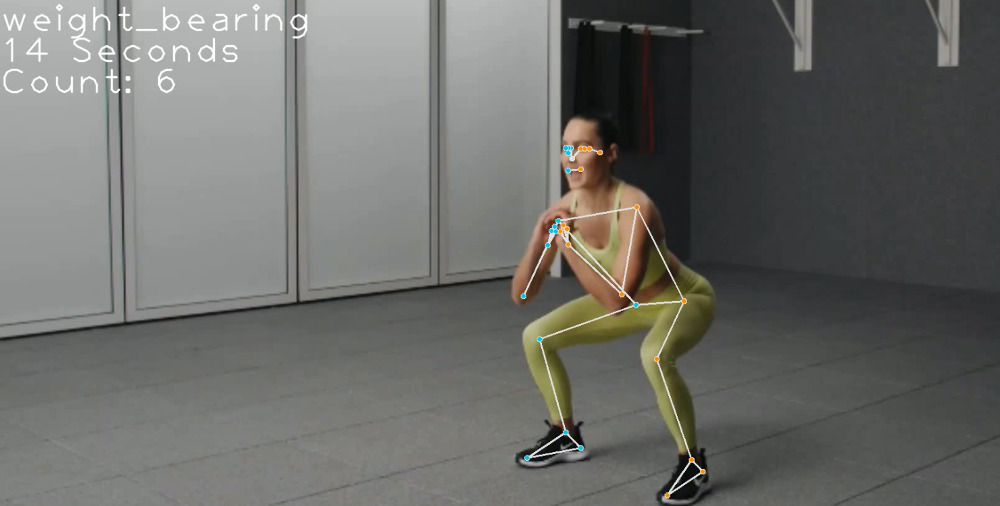

# Fitness Activity Recognition
This repository contains all the code developed for the **Fitness Activity Recognition** track as part of the fellowship cohort by LaunchPad AI of the period from Jan-Mar 2022 and Apr-Jun 2022.

### BlazePose: A 3D Pose Estimation Model

MediaPipe Pose (BlazePose) is a ML solution for high-fidelity body pose tracking, inferring 33 3D landmarks, and background segmentation mask on the whole body from RGB video frames. Each of the landmarks(joints) contains the X, Y and Z coordinates, where Z is the depth. Using this, we converted all the videos into coordinates (99 total on X, Y, and Z axis) per frame and created a new CSV file with all the data extraction points. We created a new column in our CSV with unique name for every video. 

### Google RepNet

RepNet is a model that takes as input a video that contains periodic action of a variety of classes (including those unseen during training) and returns the period of repetitions found therein. Our proposed application uses RepNet model for counting each class repetitions in videos.

### Demo Video

This is the screenshot from one of the demo videos we created. It contains the current activity, how long it lasted, and the repetition count from RepNet. Also, it displays the coordinates of the joints as well. You can find more demo videos on the [google drive link](https://drive.google.com/drive/folders/1l14EzbRZ4emgrHJdcT3wXN5v9YKRZG4J?usp=sharing).

### Feature Engineering:

#### 1. Momentum: 

The intuition is the idle states (talking, walking and sitting) tends to have less changes in the cordinates hence the momentum will be less compare to high dynamics workout/activities(running, jumping and push-ups).

#### Masking:
Masking was used at the end for some miss-classified prediction in between. We masked maximum 2 wrong prediction in between by taking mode of 5 frames (2 previous frame and 2 coming frame).

### What are the different classes?
* aerobic - Any activity that you do for more than a few minutes at a time
  * ex) Swimming, Rowing, Cycling, Dancing, Hiking
* coordination_agility - Any activity that requires to move quickly and easily, helps prevent falls and injuries by improving your reflexes, coordination and focus
  * ex) Quick feet, Side steps, High knees, Lateral crossovers
* weight_bearing - Any activity in which you hold yourself up against gravity 
  * ex) Running, Cross-country skiing, Standing yoga poses, Body-weight squats, Standing bicep curls
* calisthenics - Any activity that are using own body weight as resistance
  * ex) Pull-ups, Planks, Glute bridges, Lunges, Handstands
* balance_stability - Fitness training that tests your ability to stand on one or two legs while moving other parts of your body
  * ex) Split squats, Tai chi, Single-leg deadlifts
* flexibility - Activities that enhances the ability of your muscle to stretch
  * ex) Yoga, Stretching
* weightlifting - Lifting weights
  * ex) Rows, Dumbbell lunges, Bench Press, Deadlift
* idle - Not on any activity status
  * ex) Standing, Talking

### Classifier

For the task of  multi-class classification of our preprocessed data ExtraTrees has been used. Earlier, the last cohort had used XGBoost which didn't gave good results with BlazePose/Mediapipe coordinates. But after testing several classifiers like SVM, catBoost, MultiLayer Perceptrons or Artificial Neural Networks we concluded with ExtraTrees as our classifier.  
The reasons we choose ExtraTrees as our classifier are:

* ExtraTrees takes lesser time to train.
* We were able to get an accuracy of 97% with ExtraTrees.
* Highest F1 score that means lower mis-classification rate.
