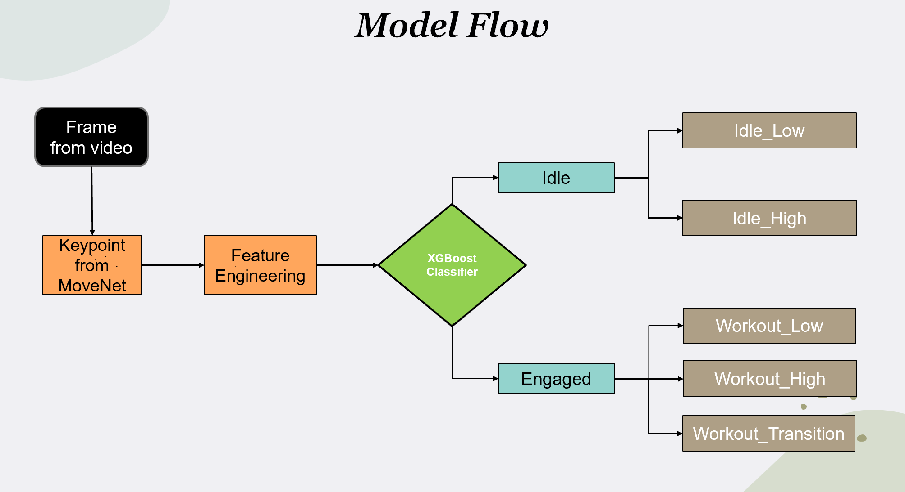
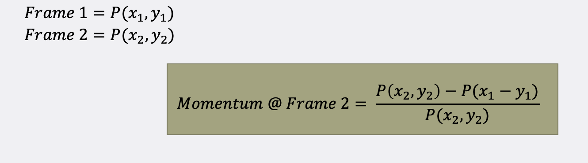

# Fitness Activity Recognition
This repository contains all the code developed for the **Fitness Activity Recognition** track as part of the fellowship cohort by LaunchPad AI of the period from Jan-Mar 2022.

# Table of Contents
  * [Setup and Requirements](#installation)
  * [Working Pipeline](#pipeline)
  * [Tutorials](#tutorials)
  * [Dataset](#dataset)
  * [Usage](#usage)


# Setup and Requirements <a id="installation"></a>
For a list of required python packages see the *requirements.txt*
or just install them all at once using pip.
```
pip install -r requirements.txt
```

# Pipeline <a id="pipeline"></a>



### Extracting Keypoints from MoveNet

MoveNet is an ultra-fast and accurate model that detects 17 keypoints of a body. Using this, we converted all the videos into coordinates (34 on X and Y axis) per frame and created a new CSV file with all the data extraction points. We created a new column in our CSV with unique name for every video. The first 17 * 3 elements are the keypoint locations and scores in the format: [y_0, x_0, s_0, y_1, x_1, s_1, …, y_16, x_16, s_16], where y_i, x_i, s_i are the yx-coordinates (normalized to image frame, e.g. range in [0.0, 1.0]) and confidence scores of the i-th joint correspondingly. The order of the 17 keypoint joints is: [nose, left eye, right eye, left ear, right ear, left shoulder, right shoulder, left elbow, right elbow, left wrist, right wrist, left hip, right hip, left knee, right knee, left ankle, right ankle].

[source: tfhub](https://tfhub.dev/google/movenet/multipose/lightning/1)


### Feature Engineering:

#### 1. Momentum: 

The intuition is the idle states (talking, walking and sitting) tends to have less changes in the cordinates hence the momentum will be less compare to high dynamics workout/activities(running, jumping and push-ups).


#### Masking:
Masking was used at the end for some miss-classified prediction in between. We masked maximum 2 wrong prediction in between by taking mode of 5 frames (2 previous frame and 2 coming frame).


### What are the different classes?
We bifurcated our data into 2 classes- Idle and Workout. Idle class was further classified into 2 sub-classes- idle_top(idle_standing), and idle_low(idle_lyingdown). Workout class splitted into 3 sub-classes as follows- workout top, Workout_Low, Workout_Transition.
* Idle_top- when the trainer is in the standing position.
* Idle_low- when the trainer is lying on the floor.
* Workout_top- when the trainer is doing the workout in the standing position(i.e., biceps, triceps).
* Workout_low- when the trainer is engaging in the workout while lying down (i.e., pushups, crunches).
* Workout_Transition: when the trainer is changing the workout or the time between the sets.


# Dataset <a id="dataset"></a>
As of March 28th, 2022. The team gathered, and annotated 1141 videos for training. Most recorded and downloaded from several sources including Nike Training  Club App, Youtube and other sources (all rights reserved).

Total duration 02 hours 57 minutes 38 seconds.

All videos have their own frame rates.

# Usage

### <ins>**Step 1**</ins>
Set the desired model parameters in the config file.

[Config File](./config.yaml)

Description:

### <ins>**Step 2**</ins>
Run the data preprocessing file

[Data Preprocessing file](./data_preprocessing.py)

Description: The functions in this script takes is given the directory that has all the video files and takes in the excel sheet that has all videos from that same directory annotated. The output is a processed csv file that contains each video's name, id, length and annotations for each second.
We standardized to 60 second videos.


### <ins>**Step 3**</ins>

[Data Wrangling File](data_wrangling.pyy)

Run the data extraction file and making sure to read the correct video annotated csv file in line 14 of the file.

### <ins>**Step 4**</ins>

[Save Train Test Split](save_train_test_split.py)

Run the file that saves the train test split .npy files. 
Make sure to load the appropriate 'data_from_file.csv' and store it in the DataFromFile dataframe. 

### <ins>**Step 5**</ins>

[Run xgboost model](run_model.py)

This file loads the previously saved .npy file directly into the model, creates confusion matrices and prints other metrics.


